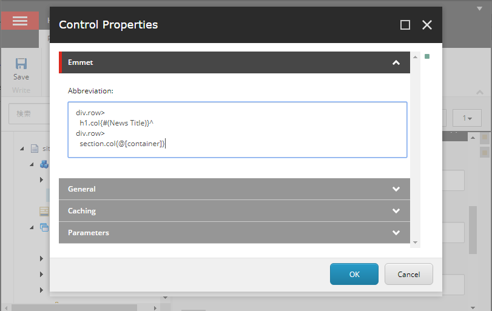
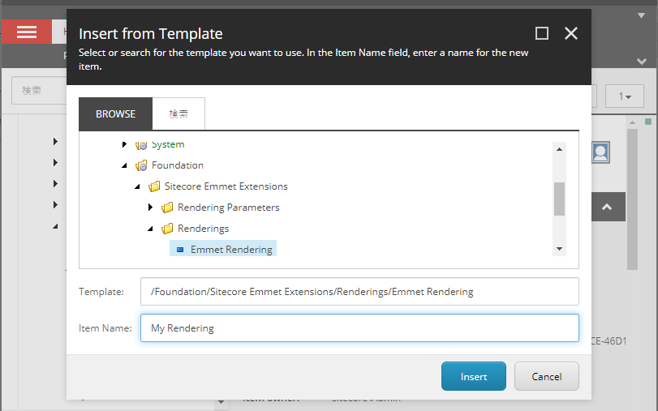

[English](./README.md) | [日本語](./README.ja.md)

# Sitecore Emmet Extensions
*Sitecore Emmet Extensions* はEmmetの短縮記法でレンダリングを作成することができるSitecoreの拡張モジュールです。


**注意：このソフトウェアは開発初期の段階にあります。**

## インストール方法
[こちら](https://github.com/xirtardauq/flexible-container/releases)からパッケージをダウンロードし、インストールウィザードを使用してSitecoreにインストールしてください。

## 使い方
`Emmet Abbreviation`レンダリングを使うことで、Emmet記法のコンテンツを表示することができます。（`/sitecore/Layouts/Renderings/Feature/Sitecore Emmet Extensions`にあります）

1. ページに`Emmet Abbreviation`レンダリングを追加します。  
1. レンダリングの`Abbreviation`パラメータにEmmet記法でコンテンツを入力します。  

<details>
  <summary>図解を見る</summary>
  
  
</details>

### コンテンツの再利用方法
コンテンツに名前を付けたり使い回したりするには、`Emmet Rendering`テンプレートを使用します。（`/sitecore/templates/Foundation/Sitecore Emmet Extensions/Renderings`にあります）

1. `Emmet Rendering`テンプレートのレンダリングアイテムを作成します。  
1. 作成したレンダリングの`Abbreviation`フィールドにEmmet記法でコンテンツを入力します。  
1. ページに作成したレンダリングを追加します。  

<details>
  <summary>図解を見る</summary>
  
  
  
</details>

## 特殊構文
*Sitecore Emmet Extensions*には、[通常のEmmetの構文](https://github.com/xirtardauq/EmmetSharp)に加えて、以下のような特殊な構文が追加されています。

- [静的プレースホルダ](#user-content-静的プレースホルダ)
- [動的プレースホルダ](#user-content-動的プレースホルダ)
- [フィールド](#user-content-フィールド)
- [翻訳](#user-content-翻訳)
- [リンク](#user-content-リンク)

以下で説明する展開例は、あくまで同じように出力されるRazor文を表しています。実際にはRazor文を介さずに直接HTMLが生成されます。

### 静的プレースホルダ
**構文:** `[placeholder-key]`

**展開例:**  

- 入力
```
div{[placeholder-key]}
```

- 結果
```html
<div>
    @Html.Sitecore().Placeholder("placeholder-key")
</div>
```

**注意:**  
テキストの間にプレースホルダを挿入する場合は、`{text1}+{[ph-within-text]}+{text2}`のようにプレースホルダの前後でテキストを区切ってください。

### 動的プレースホルダ
**構文:** `@[placeholder-key]`

**パラメータ:**
|パラメータ|型|説明|
|-|-|-|
|`count`|int|`Html.Sitecore().Placeholder`の`count`引数に渡される値.|
|`maxCount`|int|`Html.Sitecore().Placeholder`の`maxCount`引数に渡される値.|
|`seed`|int|`Html.Sitecore().Placeholder`の`seed`引数に渡される値.|

**展開例 1:**  
- 入力
```
div{@[placeholder-key]}
```

- 結果
```html
<div>
    @Html.Sitecore().DynamicPlaceholer("placeholder-key")
</div>
```

**展開例 2:**  
- 入力
```
div{@[placeholder-key|count:3|seed:1]}
```

- 結果
```html
<div>
    @Html.Sitecore().DynamicPlaceholer("placeholder-key", count: 3, seed: 1)
</div>
```

### フィールド
**構文:** `#(field-name)`

**パラメータ:**
|パラメータ|型|説明|
|-|-|-|
|`editable`|bool|エクスペリエンスエディタでの編集の無効化/有効化を指定する|
|`fromPage`|bool|trueを指定すると、データソースの代わりに現在のページのフィールドを使用する|
|`raw`|bool|trueを指定すると、フィールドのRaw値が表示される。|

**展開例 1:**
- 入力
```
p{Value is: #(Title|editable:false)}
```

- 結果
```html
<p>Value is @Html.Sitecore().Field("Title", new { DisableWebEdit: true })</p>
```

**展開例 2:**  
リンクフィールドで指定したアイテムを使用するには、リンクフィールド名の後にピリオドを書き、それに続いて表示するフィールド名を記入します。

- 入力
```
p{Category Name: #(Category.Name)}
```

- 結果
```html
@{
    var category = ...; // "Category"フィールドで指定したアイテム
}
<p>Value is @Html.Sitecore().Field("Name", category)</p>
```

### 翻訳
**構文:** `@(dictionary-key)`

**展開例:**
- 入力
```
h1{@(Title)}
```

- 結果
```html
<h1>@Translate.Text("Title")</h1>
```

### リンク
**構文:** `->(path-or-id)`

**展開例 1:**
- 入力
```
a[href="->(2f83dec8-25bd-4663-a11a-c294fd016573)"]{Link to about}
```

- 結果
```html
@{
    var item = Context.Database.GetItem("2f83dec8-25bd-4663-a11a-c294fd016573");
}
<a href="@LinkManager.GetItemUrl(item)">Link to about</a>
```

**展開例 2:**  
この構文はフィールド構文と組み合わせて使用することもできます。以下の例ではSearch Pageフィールドで指定したアイテムへのリンクを生成しています。

- 入力
```
a[href="->(#(Search Page|raw:true))"]{Link to search}
```

- 結果
```html
@{
    var item = ...; // "Search Page"フィールドで指定したアイテム
}
<a href="@LinkManager.GetItemUrl(item)">Link to search</a>
```

**注意:**  
Emmetの短縮記法では、`p{foo}bar}`のようにテキスト内に波括弧を含めることができません。そのため、この構文でIDを使用する際には、例1のように波括弧無しで入力する必要があります。

## 参考リンク
- [Emmet &#8212; the essential toolkit for web-developers](https://emmet.io/)
- [xirtardauq/EmmetSharp: An Emmet abbreviation parser written in C#](https://github.com/xirtardauq/EmmetSharp)

## ライセンス
*Sitecore Emmet Extensions*はMITライセンスでリリースされています。

## 作者
- 山田拓実 (xirtardauq@gmail.com)
