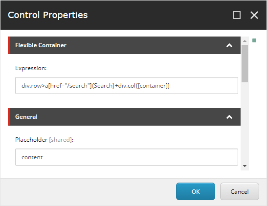

# Flexible Container
*Flexible Container* is a Sitecore rendering to generate a placeholder container with Emmet-like syntax.

**This software is in early stage of development.**

## Usage
1. Download the package from [here](https://github.com/xirtardauq/flexible-container) and install it to Sitecore.
1. Add the `Flexible Container` rendering (located in `Renderings/Feature/Flexible Container`) to a page layout.
1. Set an expression to the `Expression` rendering parameter.



The example expression above is rendered like the following.

```html
<div class="row">
    <a href="/search">Search</a>
    <div class="col">
        @Html.Sitecore().Placeholder("container")
    </div>
</div>
```

## Special Syntax
*Flexible Container* supports a part of emmet syntax, and some special syntax is added.

### Static Placeholder
A static placeholder is rendered with `{[placeholder-key]}` syntax at the content position.

**Expression:**
```
div{[placeholder-key]}
```

**Rendered:**
```html
<div>
    @Html.Sitecore().Placeholder("placeholder-key")
</div>
```

### Dynamic Placeholder
A dynamic placeholder is rendered with `{@[placeholder-key]}` syntax.

**Expression:**
```
div{@[placeholder-key]}
```

**Rendered:**
```html
<div>
    @Html.Sitecore().DynamicPlaceholer("placeholder-key")
</div>
```

\
You can use this syntax with the `count`, `maxCount`, `seed` parameters.

**Expression:**
```
div{@[placeholder-key|count:3|maxCount:10|seed:5]}
```

**Rendered:**
```html
<div>
    @Html.Sitecore().DynamicPlaceholer("placeholder-key", count: 3, maxCount: 10, seed: 5)
</div>
```

## Todo List
- [x] Nest (`div>p`)
- [x] Class & ID (`div#id`, `a.class1.class2`)
- [x] Attributes (`input[type="checkbox" checked]`)
- [x] Content (`a{Content}`)
- [x] Sibling (`p+p`)
- [x] Grouping (`p+(div>h1)+p>a`)
- [ ] Iteration (`a*5`)
	- [ ] Iterate counter `p*5>a{text $}`
- [x] Placeholder
	- [x] Static (`div{[place-holder-key]}`)
	- [x] Dynamic (`div{@[place-holder-key]}`)
        - [x] With parameters (`div{@[key|count:3|maxCount:3|seed:5]}`)
- [ ] Field interpolation (`h1{Title: {Title}}`)
- [ ] Translation: (`h1{@(dictionary-key)}`)

## See also
- [Emmet — the essential toolkit for web-developers](https://emmet.io/)

## License
*Flexible Container* is licensed unther the MIT license. See LICENSE.txt.

## Author
- Takumi Yamada (xirtardauq@gmail.com)