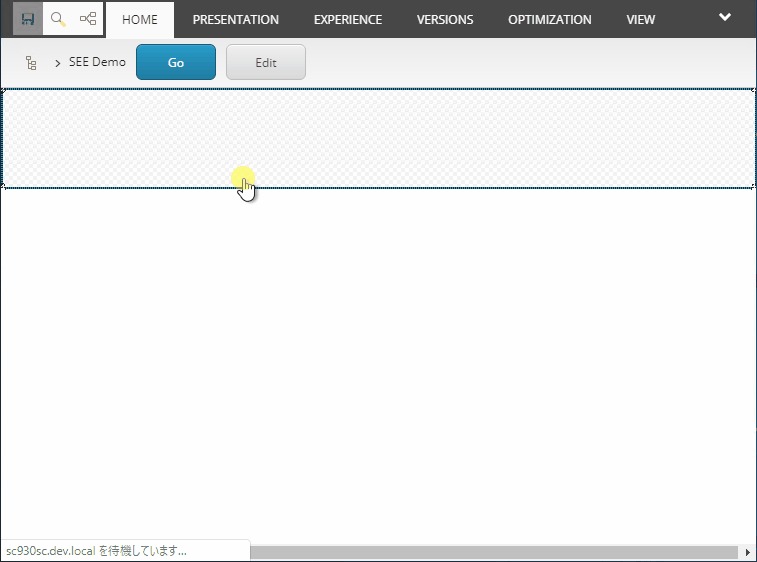

[English](./README.md) | [日本語](./README.ja.md)

# Sitecore Emmet Extensions
*Sitecore Emmet Extensions* is a Sitecore module to make a rendering with Emmet abbreviation.



**This software is in early stage of development.**

## Installation
Download the package from [here](https://github.com/xirtardauq/flexible-container/releases) and install it to Sitecore.

## Usage
Use the `Emmet Abbreviation` rendering (located in `/sitecore/Layout/Renderings/Feature/Sitecore Emmet Extensions`) to render an abbreviation.  

1. Add the `Emmet Abbreviation` rendering to a page.
1. Set an abbreviation to the `Abbreviation` rendering parameter.  

<details>
  <summary>See images</summary>
  
  
</details>

### Reuse Abbreviation
If you want to name and reuse an abbreviation, use the `Emmet Rendering` template (located in `/sitecore/templates/Foundation/Sitecore Emmet Extensions/Renderings`).

1. Create a rendering item derived from the `Emmet Rendering` template.  
1. Set an abbreviation to the `Abbreviation` field of the rendering.  
1. Add the rendering to a page.  

<details>
  <summary>See images</summary>
  
  
  
</details>

## Special Syntax
In *Sitecore Emmet Extensions*, the following syntax can be used in addition to [Emmet syntax](https://github.com/xirtardauq/EmmetSharp).

- [Static Placeholder](#user-content-static-placeholder)
- [Dynamic Placeholder](#user-content-dynamic-placeholder)
- [Field](#user-content-field)
- [Translation](#user-content-translation)
- [Link](#user-content-link)

All the following examples just means a Razor code that is output as the same result. In reality, the result is directly rendered as HTML without going through Razor code.

### Static Placeholder
**Syntax:** `[placeholder-key]`

**Example:**  

- Abbreviation
```
div{[placeholder-key]}
```

- Result
```html
<div>
    @Html.Sitecore().Placeholder("placeholder-key")
</div>
```

**NOTE:**  
Using this syntax within the text is not allowed (e.g. `{foo[ph-within-text]bar}`). Split before and after the placeholder like `{foo}+{[ph-within-text]}+{bar}`.

### Dynamic Placeholder
**Syntax:** `@[placeholder-key]`

**Parameters:**
|Parameter|Type|Description|
|-|-|-|
|`count`|int|A value passed to `Html.Sitecore().Placeholder`'s `count` argument.|
|`maxCount`|int|A value passed to `Html.Sitecore().Placeholder`'s `maxCount` argument.|
|`seed`|int|A value passed to `Html.Sitecore().Placeholder`'s `seed` argument.|

**Example 1:**  
- Abbreviation
```
div{@[placeholder-key]}
```

- Result
```html
<div>
    @Html.Sitecore().DynamicPlaceholer("placeholder-key")
</div>
```

**Example 2:**  
- Abbreviation
```
div{@[placeholder-key|count:3|seed:1]}
```

- Result
```html
<div>
    @Html.Sitecore().DynamicPlaceholer("placeholder-key", count: 3, seed: 1)
</div>
```

### Field
**Syntax:** `#(field-name)`

**Parameters:**
|Parameter|Type|Description|
|-|-|-|
|`editable`|bool|Switch enable/disable editing on the Experience Editor.|
|`fromPage`|bool|When set true, force to use a context page instead of a datasource.|
|`raw`|bool|When set true, render a field as raw value.|

**Example 1:**
- Abbreviation
```
p{Value is: #(Title|editable:false)}
```

- Result
```html
<p>Value is @Html.Sitecore().Field("Title", new { DisableWebEdit: true })</p>
```

**Example 2:**  
If you want to use a link field, write a period after a link field, and write a field name to follow the period
- Abbreviation
```
p{Category Name: #(Category.Name)}
```

- Result
```html
@{
    var category = ...; // A category specified in the "Category" field.
}
<p>Value is @Html.Sitecore().Field("Name", category)</p>
```

### Translation
**Syntax:** `@(dictionary-key)`

**Example:**
- Abbreviation
```
h1{@(Title)}
```

- Result
```html
<h1>@Translate.Text("Title")</h1>
```

### Link
**Syntax:** `->(path-or-id)`

**Example 1:**
- Abbreviation
```
a[href="->(2f83dec8-25bd-4663-a11a-c294fd016573)"]{Link to about}
```

- Result
```html
@{
    var item = Context.Database.GetItem("2f83dec8-25bd-4663-a11a-c294fd016573");
}
<a href="@LinkManager.GetItemUrl(item)">Link to about</a>
```

**Example 2:**  
This syntax can be collaborated with Field syntax. The example below renders an URL to an item that is specified in the Search Page field.

- Abbreviation
```
a[href="->(#(Search Page|raw:true))"]{Link to search}
```

- Result
```html
@{
    var item = ...; // An item specified in the "Search Page" field.
}
<a href="@LinkManager.GetItemUrl(item)">Link to search</a>
```

**NOTE:**  
Due to Emmet's text syntax cannot be contained an end brace (e.g. `{foo}bar}`), so **an ID in link syntax should not contain braces like Example 1.**

## See also
- [Emmet &#8212; the essential toolkit for web-developers](https://emmet.io/)
- [xirtardauq/EmmetSharp: An Emmet abbreviation parser written in C#](https://github.com/xirtardauq/EmmetSharp)

## License
*Sitecore Emmet Extensions* is licensed unther the MIT license. See LICENSE.txt.

## Author
- Takumi Yamada (xirtardauq@gmail.com)
